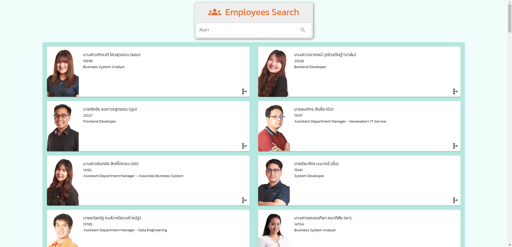
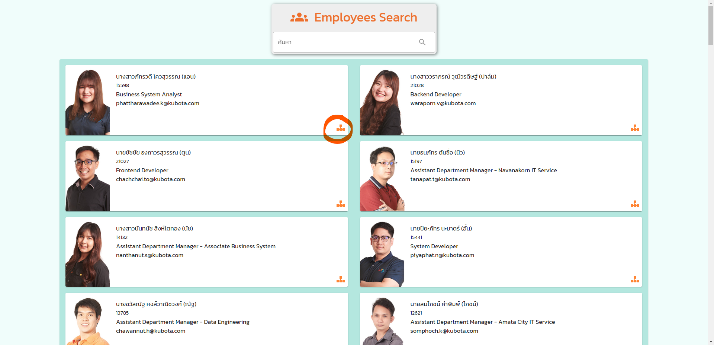
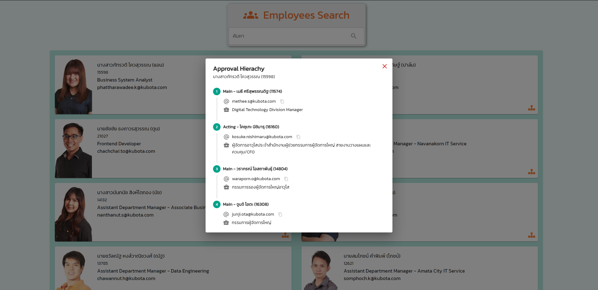

# Employees Search
###  Exercise 1 (source: [`08.1_employee-search-app`](https://github.com/SiamKubota/react-guide/tree/master/08.1_employee-search-app))
1. แก้ไขสไตล์ปุ่มไอคอน Hierachy ที่มุมขวาของ EmployeeCard แต่ละใบ
	> **Starter UI**
	
	
	> **Finished UI**
	
2. สร้าง Modal (Dialog in MUI) สำหรับแสดงรายละเอียดสายการอนุมัติของ employee แต่ละคน
	* Title ให้แสดง คำนำหน้า ชื่อ สกุล และรหัสพนักงาน ตามข้อมูลจาก Card ที่คลิก
	* Content สามารถ Mock up ข้อมูลได้
		> Copy from `https://empsearch.azurewebsites.net/approval/{your-employee-id}` 				> Inspect mode > Network
		
		> Finished UI 
		
3. [**`Solution`**](https://github.com/SiamKubota/react-guide/tree/master/08_employee-search-app) (ลองทำก่อนไปต่อไม่ไหว ค่อยดูเฉลยนะ)
